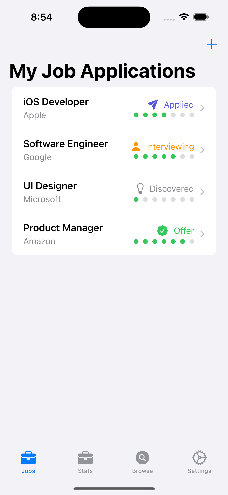
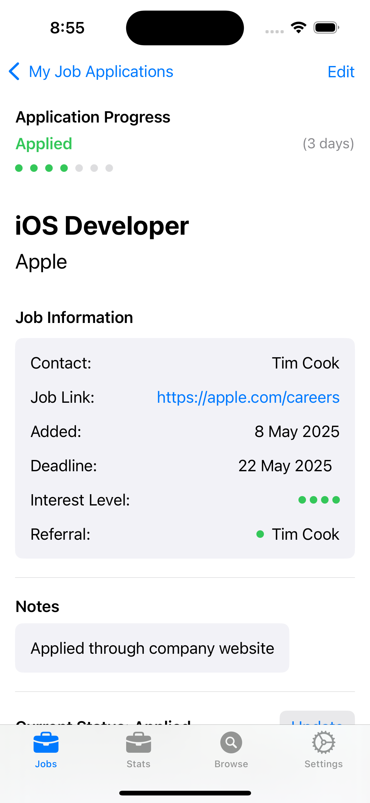
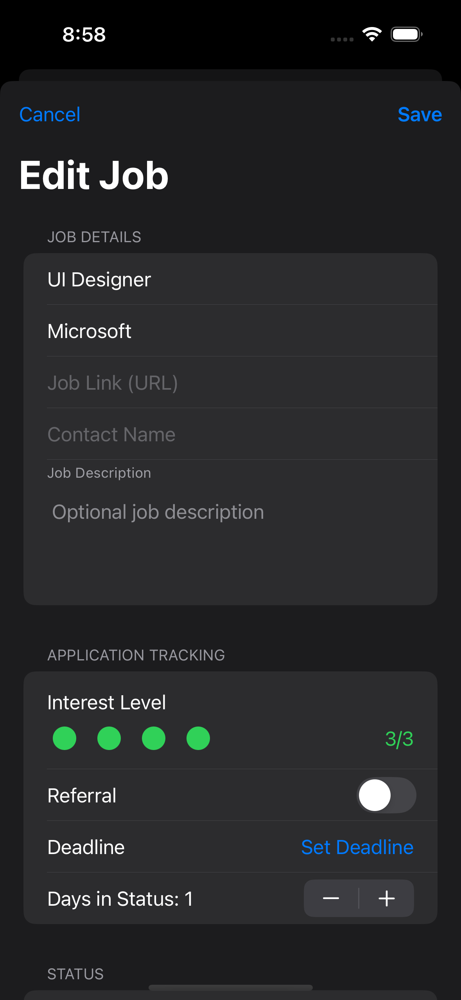
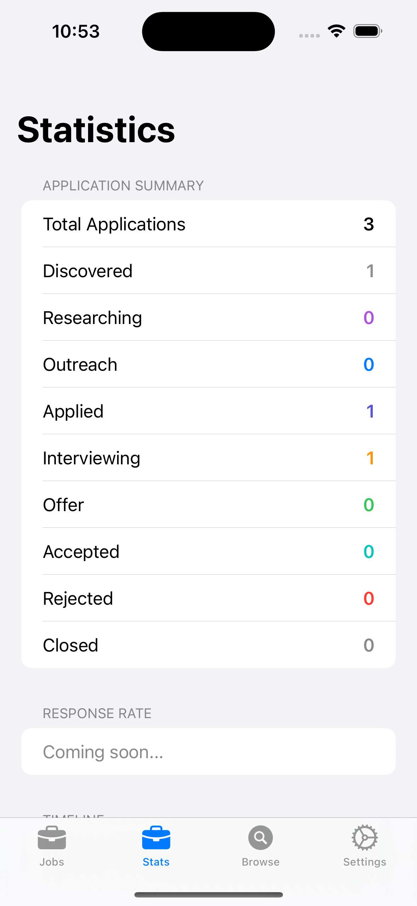
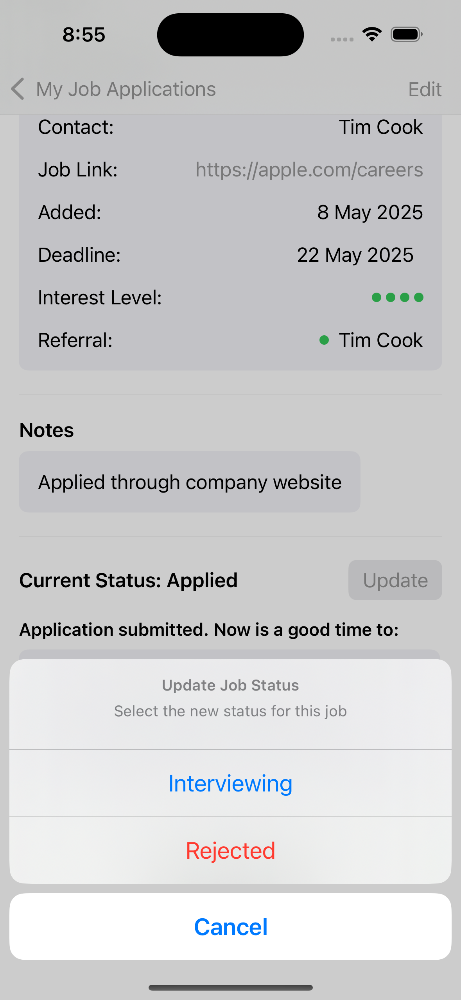

# Job Tracker

**Job Tracker** is a SwiftUI app designed to make job hunting less chaotic and more intentional. It helps users stay on top of every opportunity — from discovering a role to getting the final result. Whether you're actively applying or just keeping an eye out, Job Tracker brings structure and clarity to the process.

## What It Does

- Keeps all job applications organised in one place
- Tracks each role’s progress — from discovery to offer (or closure)
- Stores useful details like contacts, notes, and URLs
- Provides colour-coded status indicators for quick overviews
- Suggests next actions based on where you're up to
- Uses a clean, tab-based layout for intuitive navigation

## Screenshots

| Home | Detail | Detail (Dark) |
|------|--------|----------------|
|  |  |  |

| Edit (Dark) | Settings | Stats |
|-------------|----------|-------|
|  |  |  |

| Update |
|--------|
|  |

_(Screenshots live in `images/` directory, grouped by screen)_

## Status Workflow

Each job moves through clearly defined stages:

- **Discovered** – role looks promising
- **Researching** – investigating the company and position
- **Outreach** – connecting with someone inside the org
- **Applied** – application submitted
- **Interviewing** – in process
- **Offer** – received an offer
- **Accepted** – offer accepted
- **Rejected** – not moving forward
- **Closed** – wrapped up (e.g. filled, withdrawn, no longer relevant)

## What You Can Track

Each entry includes:

- Job title
- Organisation name
- URL to the listing
- Contact person (if applicable)
- Flags for research, outreach, application
- Current status/stage
- Freeform notes

## Tech Stack

- **SwiftUI** for the frontend
- **Swift 5**
- **UserDefaults** for lightweight persistence (Core Data or SwiftData support coming)
- Runs on iOS 15+

## In Action

Job Tracker provides a clear overview with status dots and colour cues. Users can easily drill into a job to see what’s next — whether it's researching, following up, or preparing for an interview.

## Roadmap

Current development efforts are focused on:

- **AI-powered job discovery** – surfacing roles based on user history and preferences
- **Smart autofill** – extracting job details from URLs or job boards
- Backend improvements using **Core Data or SwiftData**
- Expanded in-app guidance tailored to each stage of the job hunt

---

Job Tracker aims to give users back control over their job search — with less stress, more visibility, and smarter tools to support the process.
